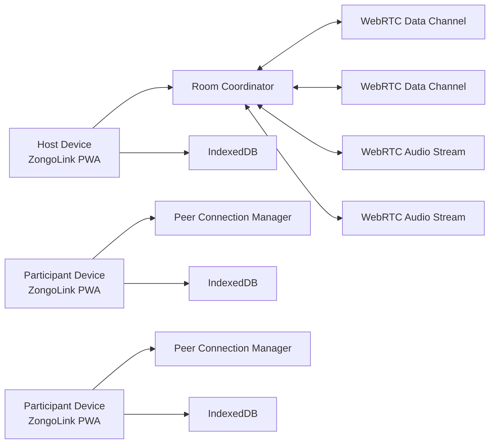
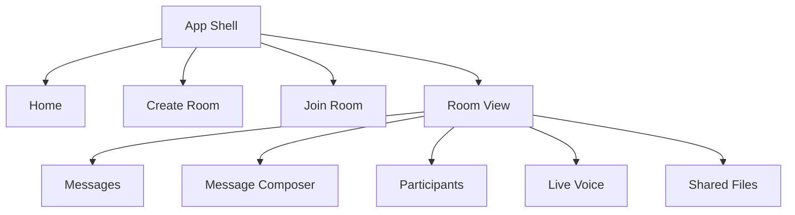
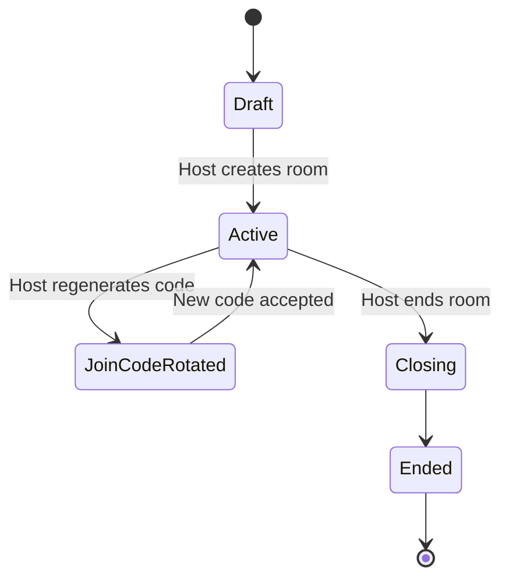
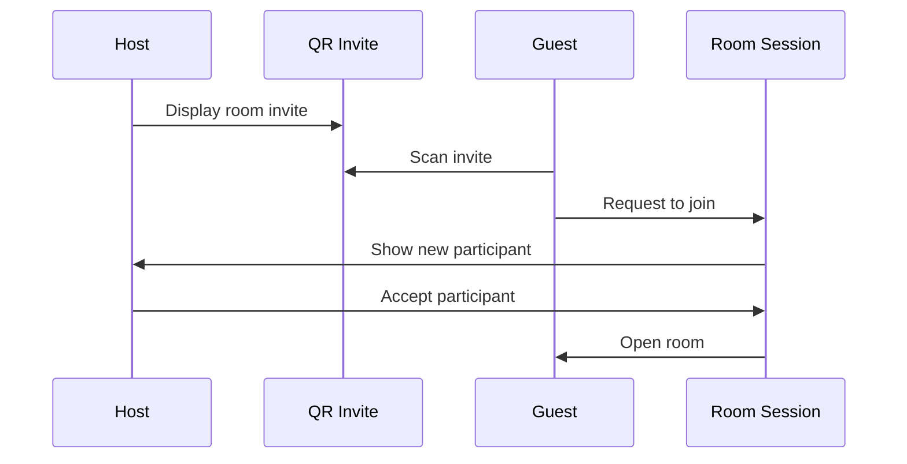
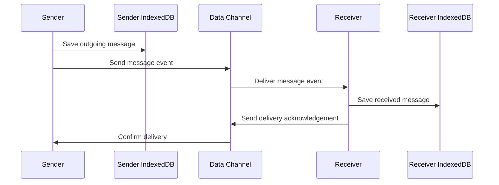
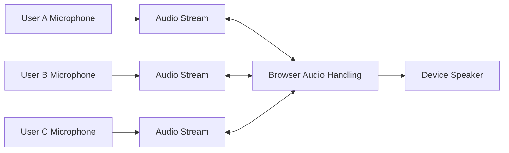
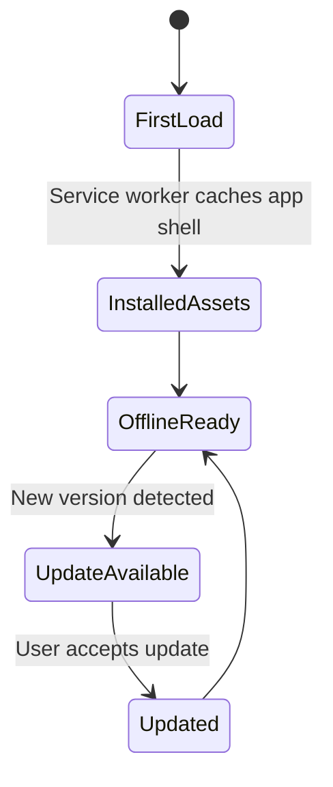

# ZongoLink-V1 Architecture

ZongoLink-V1 is an offline-first Progressive Web App (PWA) for local communication between users on the same Wi-Fi network or mobile hotspot. This document describes the intended architecture for the V1 product and explains the major technical decisions.

No application source code is included in this document. Diagrams are provided for planning and communication only.

## Technical Stack

### Frontend

- React for the user interface.
- TypeScript for safer application logic and clearer contracts.
- Vite for fast local development and optimized builds.
- Tailwind CSS for responsive, mobile-first styling.

### Storage

- IndexedDB for local structured data, message history, metadata, and offline persistence.

### PWA

- Service workers for offline-first asset caching and app lifecycle behavior.
- Web app manifest for installability and app-like launch behavior.

### Communication

- WebRTC Data Channels for text messages, control events, and file transfer.
- WebRTC Audio Streams for live voice communication.

## Architecture Principles

- Offline-first by default.
- Mobile-first user experience with desktop support.
- No visible IP addresses or networking terminology in the user interface.
- Local-only communication in V1.
- Simple flows for non-technical users.
- Clear internal boundaries so future V2 features can be added without rewriting the product.

## 1. System Architecture

ZongoLink-V1 is a client-side local communication system. Each device runs the PWA in a browser or installed PWA shell. One user creates a room and acts as the room host. Other users join the room using a passcode or QR code. After joining, devices communicate through WebRTC connections.

The app is organized around local device state, room coordination, peer connections, and media/file exchange.

Justification:

- A client-side PWA keeps the product lightweight and installable.
- WebRTC supports encrypted peer-to-peer data and audio without a cloud server.
- IndexedDB gives each device durable local state without requiring accounts.
- A host-led room model is easier for non-technical users to understand than a fully distributed system.

## 2. Frontend Architecture

The frontend should be a React application split into feature-oriented modules. TypeScript should define stable internal contracts between room logic, messaging, media, storage, and UI components.

Recommended frontend layers:

- App shell: routing, layout, install prompts, offline-ready entry points.
- Feature views: home, create room, join room, room conversation, live voice, settings.
- Domain services: room management, peer connection management, messaging, media transfer, storage.
- UI components: buttons, inputs, room cards, message bubbles, participant list, media previews.
- Infrastructure adapters: IndexedDB adapter, service worker registration, QR scanning/generation, WebRTC wrapper.

Justification:

- Feature-oriented organization keeps room, messaging, voice, and transfer logic understandable.
- TypeScript contracts reduce accidental breakage in real-time communication paths.
- Separating domain services from UI components makes future V2 transport changes easier.

## 3. Component Architecture

The component architecture should prioritize simple, task-focused screens for non-technical users.

Primary component groups:

- Entry components: start screen, create room action, join room action.
- Room setup components: room name form, passcode display, QR display, invite sharing panel.
- Join components: passcode entry, QR scanner, join progress, friendly error states.
- Conversation components: message list, composer, attachment picker, voice note recorder.
- Participant components: participant list, host controls, removal confirmation, join status.
- Voice components: live voice panel, mute control, speaker indicators, leave voice action.
- Transfer components: file preview, transfer progress, received file card, retry action.
- PWA components: install prompt, offline status, update available notice.

Justification:

- Screen-level components keep navigation clear on mobile.
- Smaller feature components prevent the room screen from becoming difficult to maintain.
- Host controls are isolated from participant controls to reduce permission mistakes.

## 4. State Management Strategy

ZongoLink-V1 should use a layered state strategy:

- Local UI state for open menus, active tabs, input drafts, and modal visibility.
- Feature state for active room, participants, connection status, messages, transfers, and voice state.
- Persistent state in IndexedDB for rooms, local identity, messages, attachments, and pending transfer metadata.
- Derived state for unread counts, participant presence, transfer progress, and voice activity.

Recommended approach:

- Use React state for simple component state.
- Use a lightweight global store for room-level state shared across screens.
- Use service classes for WebRTC, storage, and media operations.
- Treat IndexedDB as the durable source for persisted records, not as a replacement for active in-memory connection state.

Justification:

- Real-time apps need fast in-memory updates, but offline-first apps also need durable local state.
- Separating volatile connection state from persisted records avoids confusing stale peer data with saved history.
- A lightweight store is enough for V1 and keeps the app simpler than a large state framework.

## 5. Room Management Architecture

Rooms are the main organizational unit. A room has a host, a room name, a join code, participants, messages, and shared media.

Host responsibilities:

- Create room.
- End room.
- Remove participant.
- Regenerate join code.
- Coordinate room membership events.

Participant responsibilities:

- Join room.
- Send messages.
- Send voice notes.
- Share files.
- Join live voice communication.

Room lifecycle:

Justification:

- A host-led model matches real-world group behavior and is easier to explain.
- Room lifecycle states make ending rooms and regenerating codes predictable.
- Multiple rooms can share common room services while keeping each room's state separate.

## 6. Join Code Architecture

Join codes are short, human-friendly values used to authorize room entry. They should not reveal IP addresses, ports, device identifiers, or technical connection details.

Join code properties:

- Short enough for a user to type.
- Random enough to reduce guessing.
- Scoped to a single room.
- Regenerable by the host.
- Expirable when the room ends.
- Stored locally only.

The join code should be treated as an access token, not as a network address. Internally, the app can map the join code to room invitation metadata, but the user should only see simple wording such as "Room code" or "Join code."

Justification:

- Non-technical users understand short codes.
- Regeneration gives hosts a simple safety control.
- Avoiding technical payloads in the visible code supports the product requirement that no networking terms appear in the user experience.

## 7. QR Code Architecture

QR codes provide a faster join path and reduce typing errors. The QR code should contain an invitation payload that the app can interpret, while showing users a simple "Scan to join" experience.

Recommended QR payload contents:

- Room identifier.
- Room display name.
- Join token or join code reference.
- Host display label.
- Expiration metadata.
- Cryptographic nonce or challenge value.
- Version field for future compatibility.

The QR code should not display technical details to the user. Any technical fields are internal payload data and should be validated by the app before use.

Justification:

- QR joining is faster on mobile devices.
- Including a version field protects future V2 compatibility.
- A nonce or challenge helps prevent stale or replayed invite payloads.

## 8. Local Device Discovery Strategy

V1 should use invite-based discovery rather than automatic network scanning. The app should guide users through visible actions: create a room, show a code, scan a code, or enter a code.

Important browser constraint:

- Browser-based PWAs do not have a reliable, universal API for scanning a local network or advertising a service to nearby browsers.
- WebRTC still needs a signaling exchange before peer-to-peer data channels or audio streams can connect.
- Therefore, V1 should treat passcodes and QR codes as the user-facing discovery mechanism and keep all technical negotiation behind simple screens.

Recommended V1 strategy:

- Use QR codes for the richest invite flow because QR can carry structured invitation data.
- Use passcodes as a simple access gate and room matching mechanism.
- Keep the internal signaling process abstracted behind a "joining" screen.
- Avoid showing words such as IP address, port, peer, LAN, WebRTC, signaling, candidate, or protocol in the user interface.
- Design the communication layer so a future local signaling implementation can be added without changing the user experience.

Justification:

- Invite-based discovery matches the non-technical product goal.
- It avoids exposing network details.
- It respects current browser limitations while keeping the architecture ready for improved local discovery methods.

## 9. Text Messaging Architecture

Text messaging should use WebRTC Data Channels after a participant joins a room. Messages should be represented internally as structured events with unique identifiers and timestamps.

Message flow:

Requirements:

- Messages should be stored locally before sending.
- Delivery acknowledgements should update visible status where useful.
- Duplicate message identifiers should be ignored.
- Message order should be based on local timestamps plus room sequence metadata when available.
- Failed sends should show a friendly retry state.

Justification:

- Saving before sending protects against app interruption.
- Acknowledgements improve user confidence.
- Duplicate handling is important because local connections can retry events.

## 10. Voice Notes Architecture

Voice notes are short recorded audio messages sent through the room. They are not live streams; they are media files with message metadata.

Voice note flow:

1. User records audio with microphone permission.
2. App stores a local draft recording.
3. User sends the voice note.
4. App transfers the audio data over a WebRTC Data Channel.
5. Recipients save the voice note metadata and audio blob in IndexedDB.
6. Recipients play the voice note from local storage.

Design considerations:

- Recording should show clear start, stop, preview, and send states.
- Microphone permission errors should be explained in plain language.
- Voice notes should have duration, sender, timestamp, and transfer status.
- Large voice notes should use the same chunked transfer strategy as files.

Justification:

- Treating voice notes as files keeps the architecture consistent.
- Local draft storage protects the recording if a user briefly leaves the screen.
- Voice notes are useful in low-literacy, busy, or hands-free situations.

## 11. Live Voice Communication Architecture

Live voice communication should use WebRTC Audio Streams. Users should be able to join, mute, unmute, and leave the live voice session without leaving the room.

Live voice model:

- Room membership and voice participation are separate states.
- A user can remain in the room while not participating in live voice.
- Audio streams are encrypted through WebRTC.
- Mute state is broadcast as a room event.
- Speaker activity can be derived locally from audio levels.

Justification:

- WebRTC is designed for real-time audio.
- Separating room state from voice state lets users read and send messages while voice is off.
- Host controls can remain focused on room membership rather than low-level media handling.

## 12. File Sharing Architecture

File sharing should use WebRTC Data Channels with chunked transfer. Files should be split into manageable pieces, transferred with progress updates, and reassembled by recipients.

Recommended transfer model:

- Send metadata first: file name, type, size, sender, transfer identifier.
- Transfer file content in chunks.
- Track progress per recipient.
- Support cancellation.
- Verify transfer completion.
- Store received file metadata and blob locally.

Justification:

- Chunking avoids loading very large files entirely into memory.
- Progress states make large transfers understandable.
- A shared transfer model can support generic files, images, videos, and voice notes.

## 13. Image Sharing Architecture

Image sharing is a specialized file-sharing path optimized for preview and quick recognition.

Image-specific behavior:

- Show an image preview before sending when possible.
- Generate a local thumbnail for the message list.
- Transfer the original file through the file transfer system.
- Store thumbnail metadata separately from the original image blob.
- Allow opening or saving the original image where supported.

Justification:

- Thumbnails keep the message list fast.
- Reusing the file transfer layer avoids duplicate transfer logic.
- Preview-before-send reduces accidental sharing.

## 14. Video File Sharing Architecture

Video file sharing should be treated as file transfer, not live video calling. The product explicitly excludes live video calls in V1.

Video-specific behavior:

- Show file name, size, and video type before sending.
- Avoid auto-playing received videos.
- Generate a lightweight preview only when device capability allows it.
- Use chunked transfer with progress and cancellation.
- Warn users in plain language when a video is very large.

Justification:

- Videos can be large and expensive for memory, battery, and storage.
- Keeping video as file transfer protects the V1 scope.
- Clear progress and size information prevents confusion during longer transfers.

## 15. Security Model

The V1 security model is local-first and user-mediated. It should protect against accidental access, stale invitations, and confusing exposure of technical details.

Security controls:

- Join codes are random, room-scoped, and regenerable.
- QR payloads include expiration and version metadata.
- Hosts can remove participants.
- Ended rooms no longer accept new participants.
- WebRTC provides encrypted transport for data channels and audio streams.
- Microphone and file access use browser permission prompts.
- Shared data is stored locally on each user's device.
- IP addresses and connection details are never shown in the app UI.

Limitations:

- V1 does not include user accounts.
- V1 does not depend on cloud identity or centralized moderation.
- Physical access to a displayed QR code or join code can allow someone nearby to request access.
- Device-level security remains the responsibility of the user's operating system and browser.

Justification:

- This model matches the local, account-free scope.
- Host controls provide basic room safety without requiring identity systems.
- Browser-level WebRTC encryption gives strong transport protection for local communication.

## 16. IndexedDB Data Model

IndexedDB should store durable local records for offline-first behavior. The data model should use versioned stores so future migrations are possible.

Recommended object stores:

| Store | Purpose |
| --- | --- |
| `app_settings` | Install state, display name, theme, local preferences |
| `local_identity` | Local device/user identity used inside rooms |
| `rooms` | Room metadata, host status, lifecycle state |
| `join_invites` | Active and expired invite metadata |
| `participants` | Participant records per room |
| `messages` | Text messages and message metadata |
| `attachments` | Shared file, image, video, and voice note metadata |
| `attachment_blobs` | Binary payloads for received or drafted media |
| `transfers` | Transfer progress, retry state, and completion records |
| `voice_sessions` | Live voice participation metadata |
| `room_events` | Membership, host actions, and system events |
| `outbox` | Pending messages or transfers waiting to send |

Data retention:

- Ended rooms can remain visible as local history unless the user deletes them.
- Large attachments should be removable independently from message history.
- Temporary transfer chunks should be cleaned up after completion, cancellation, or failure.

Justification:

- IndexedDB is the browser storage option suited for structured data and blobs.
- Separate stores prevent large media from slowing normal message queries.
- Versioned stores support migrations as the product evolves.

## 17. PWA Architecture

The PWA layer should make the app installable and usable without internet after the initial load or installation.

Service worker responsibilities:

- Cache the app shell.
- Serve core assets while offline.
- Provide a stable offline fallback.
- Manage updates safely.
- Avoid caching private shared files unless the app explicitly stores them in IndexedDB.

Manifest responsibilities:

- App name and short name.
- Icons for supported device sizes.
- Start URL.
- Display mode.
- Theme color and background color.
- Orientation guidance if needed.

PWA lifecycle:

Justification:

- The app must remain available when internet is unavailable.
- Service worker caching should focus on app assets, while user data remains in IndexedDB.
- Separating app updates from room data reduces the risk of losing local conversations.

## 18. Error Handling

Errors should be categorized internally and translated into plain, helpful user messages.

Internal categories:

- Permission errors.
- Room not found or expired.
- Join code invalid.
- Participant removed.
- Room ended.
- Connection interrupted.
- Transfer failed.
- Storage limit reached.
- Unsupported browser capability.

User-facing language should avoid technical terms. For example:

- Use "We could not join this room" instead of network-specific wording.
- Use "Ask the host for a new code" instead of exposing protocol or address details.
- Use "Check that everyone is nearby and using the same shared connection" without mentioning IP addresses.

Recovery behavior:

- Offer retry actions.
- Preserve unsent drafts where possible.
- Keep users in the room when a non-critical transfer fails.
- Show clear permission recovery steps for microphone and camera access.
- Log technical details internally for debugging, not in normal UI.

Justification:

- Non-technical users need clear next steps.
- Real-time local communication has many failure modes, so graceful recovery is essential.
- Internal detail is useful for development but should not leak into the product language.

## 19. Performance Considerations

Performance should be optimized for mobile devices and local network conditions.

Key considerations:

- Keep the initial PWA bundle small.
- Lazy-load QR scanning, media preview, and advanced room tools when possible.
- Virtualize long message lists.
- Use thumbnails for images and videos.
- Chunk large file transfers.
- Apply Data Channel backpressure handling.
- Avoid keeping large blobs in memory longer than necessary.
- Limit simultaneous large transfers.
- Use efficient audio constraints for live voice.
- Clean up WebRTC connections and media tracks when users leave a room or voice session.
- Monitor local storage usage and provide cleanup actions.

Justification:

- Mobile-first products must respect battery, memory, and storage.
- Large media transfers can degrade the whole room if not controlled.
- Cleanup is critical because WebRTC and media streams can continue consuming resources if not stopped.

## 20. Future ZongoLink-V2 Compatibility

V1 should be designed so V2 can add capabilities without replacing the whole architecture.

Compatibility strategies:

- Version QR payloads and room event formats.
- Keep transport logic behind a communication adapter.
- Keep storage schema versioned with migration support.
- Avoid coupling UI components directly to WebRTC primitives.
- Represent messages, transfers, and room events as stable domain objects.
- Keep host controls extensible for future moderation features.
- Keep PWA install/update logic separate from communication logic.

Potential V2 additions:

- Optional stronger identity and trusted contacts.
- Optional encrypted room backups.
- Improved local room discovery.
- Organization or school administration tools.
- Multi-language interface.
- Optional cross-network relay while preserving local-first behavior.
- Live video calls if the product scope expands.
- Screen sharing if needed for education or business use cases.

Justification:

- V1 should validate the core local communication experience.
- Clear boundaries make it possible to add V2 features without breaking existing rooms and local data.
- Versioned payloads protect compatibility as invite, message, and transfer formats evolve.
