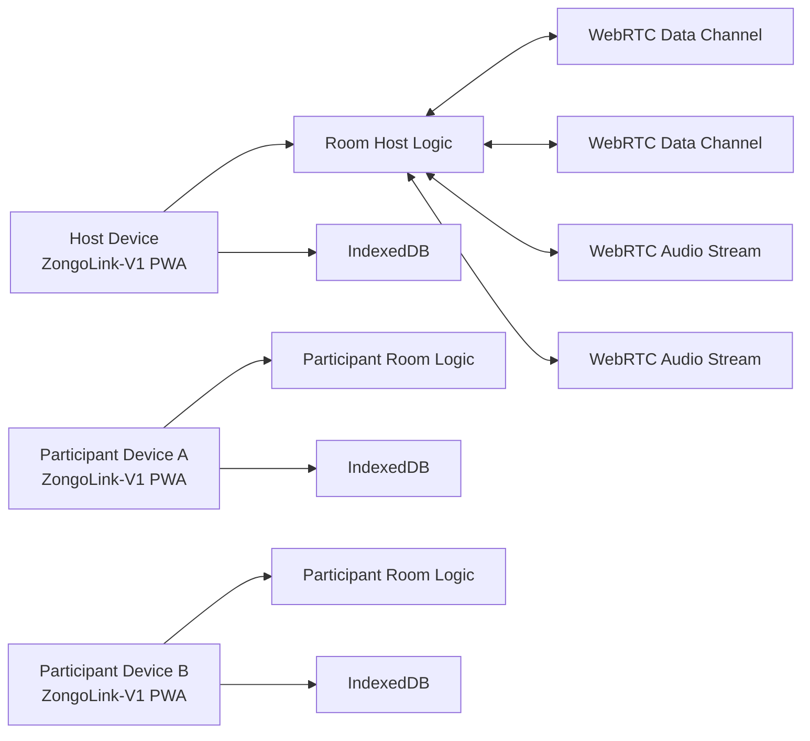
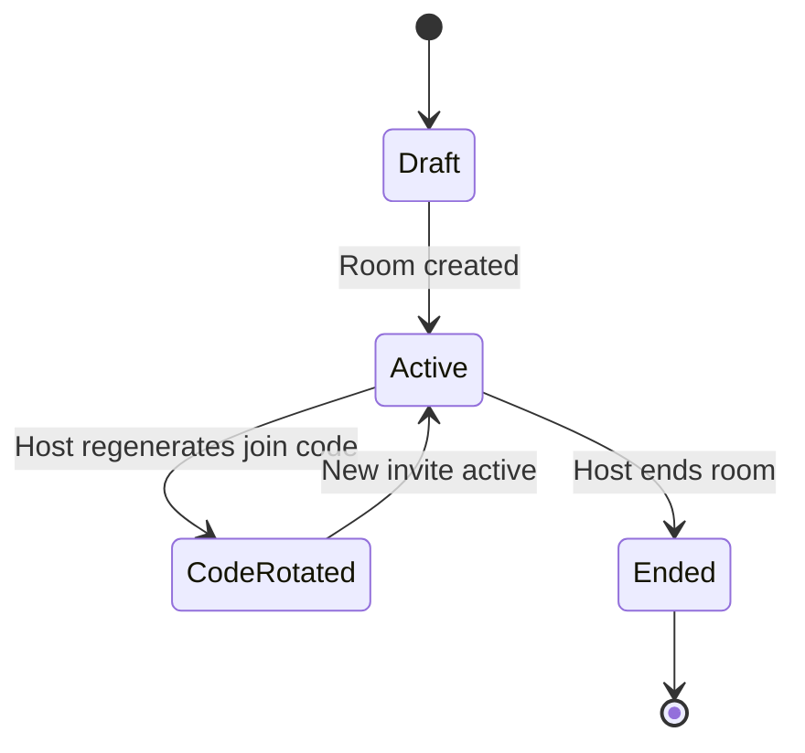
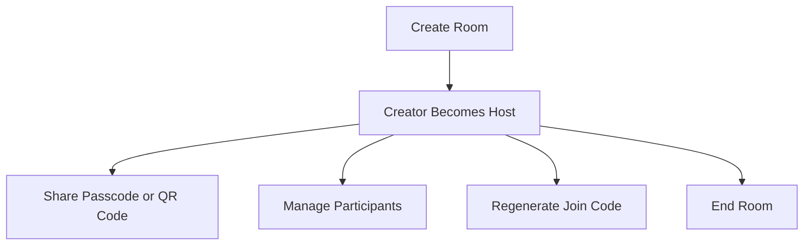
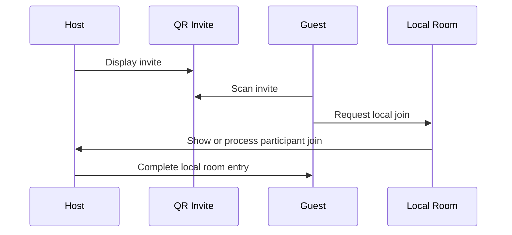
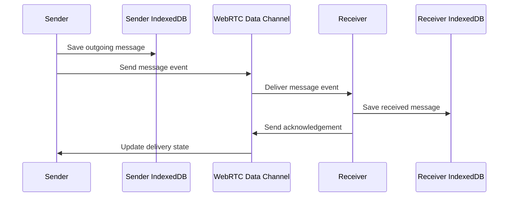
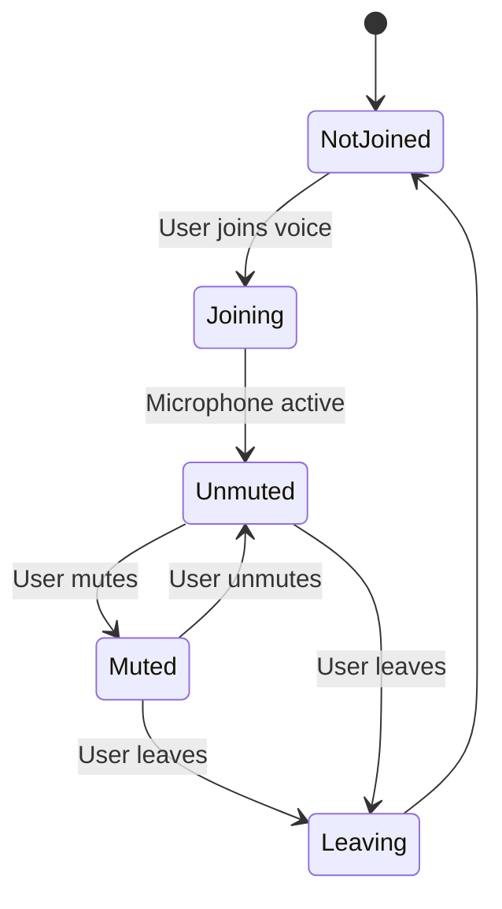
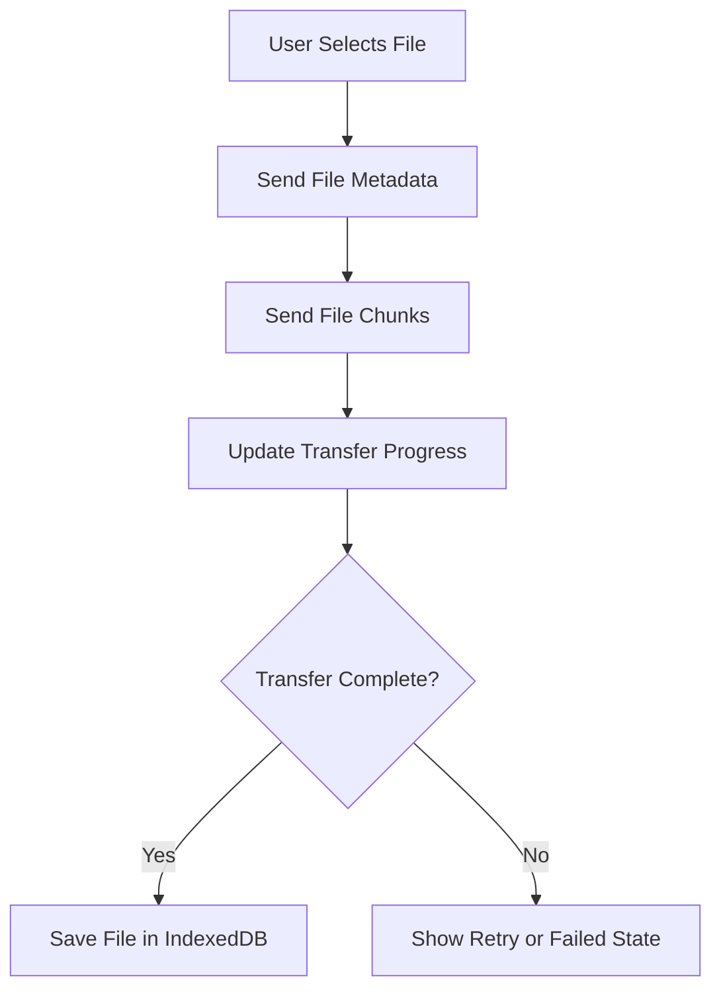
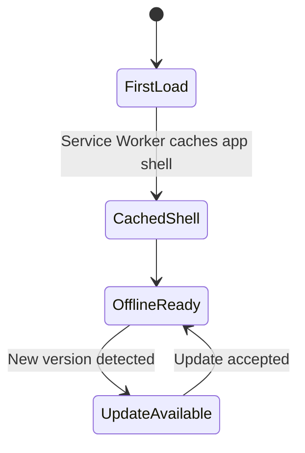

# ZongoLink-V1 Architecture

ZongoLink-V1 is an offline-first Progressive Web App (PWA) for local communication between users connected to the same Wi-Fi network or mobile hotspot. This document describes the intended V1 architecture and technical decisions.

No application source code is included in this document.

## Technology Stack

### Frontend

- React
- TypeScript
- Vite
- Tailwind CSS

### PWA

- Service Worker
- Web App Manifest

### Storage

- IndexedDB

### Communication

- WebRTC Data Channels
- WebRTC Audio Streams

## Architecture Decisions

- Communication is local-network only.
- The room creator acts as the room host.
- Multiple rooms are supported.
- Users can join by passcode.
- Users can join by QR code.
- ZongoLink-V1 has no cloud infrastructure.
- ZongoLink-V1 has no internet dependency for core communication.
- Cloud signaling servers are out of scope for V1.
- ZongoLink-V1 has no user accounts, cloud databases, internet servers, video conferencing, or screen sharing.

## 1. System Architecture

ZongoLink-V1 runs entirely in the browser or installed PWA shell. Each device stores its own local state in IndexedDB and communicates with nearby devices through WebRTC once a room connection is established.

The system is organized around four major areas:

- App shell and PWA lifecycle.
- Room and participant state.
- WebRTC communication channels.
- Local IndexedDB persistence.

The architecture must not rely on remote services for room state, message storage, account identity, media storage, signaling, or discovery. Any connection setup mechanism used in V1 must remain local and user-mediated.

## 2. Room Architecture

A room is the main communication space in ZongoLink-V1. Rooms group participants, messages, voice activity, and shared files.

Each room should include:

- Room identifier.
- Room name.
- Host identifier.
- Join code state.
- QR invite state.
- Participant list.
- Room lifecycle state.
- Message and transfer references.

The creator of a room becomes the host. Multiple rooms may exist locally, but a user should always have a clear active room context when messaging or sharing media.

Room state should be stored locally in IndexedDB so the app can recover recent room context after reloads or PWA restarts. Active peer connection state should remain in memory because WebRTC connections are live runtime objects.

## 3. Host Architecture

The host is the user who creates a room. The host owns room-level controls but still participates as a normal room member for messaging, voice, and file sharing.

Host responsibilities:

- Create the room.
- Maintain room lifecycle state.
- Share the passcode and QR code.
- Accept or coordinate participant joins.
- End the room.
- Remove participants.
- Regenerate join codes.
- Broadcast room events to connected participants.

Host-only actions should be represented as room events so all connected participants receive consistent updates. Participants should not be able to perform host-only actions unless they are the room creator for that specific room.

## 4. Join Code Architecture

Join codes are short, human-friendly values used to join rooms. They are not user accounts, passwords for cloud services, or internet addresses.

Join code requirements:

- Scoped to one room.
- Generated by the host device.
- Regenerable by the host.
- Invalid after room end.
- Simple enough to type.
- Random enough to reduce casual guessing.
- Stored locally only.

Join codes should never expose IP addresses, ports, protocols, or other technical connection details. If a join attempt fails, the user-facing message should explain the next action in plain language, such as asking the host for a new code.

## 5. QR Code Architecture

QR codes provide a faster join path, especially on mobile devices. A QR invite should contain only the minimum room invitation metadata needed for local joining.

Recommended QR invite fields:

- Invite version.
- Room identifier.
- Room display name.
- Join token or code reference.
- Host display label.
- Expiration metadata.
- Random nonce.

QR payloads must not depend on a cloud database or internet server. The QR code should help the participant start a local room join flow and validate that they are joining the intended room.

## 6. Local Device Discovery

ZongoLink-V1 uses invite-based local discovery. Users discover rooms through a host-shared passcode or QR code, not through public search, accounts, cloud lists, or internet directories.

Important browser constraint:

- Browser PWAs do not have a universal API for automatic local network service discovery.
- WebRTC needs a connection setup exchange before Data Channels or Audio Streams can connect.
- V1 must keep connection setup local and user-mediated.
- Cloud signaling servers must not be introduced as a default, fallback, or convenience path.

Discovery strategy:

- Use QR codes for richer local invitation metadata.
- Use passcodes as the simple typed join method.
- Keep all technical negotiation behind friendly join screens.
- Avoid exposing IP addresses, ports, protocol names, peer identifiers, or connection setup details in normal user-facing UI.
- If a browser limitation blocks a fully automatic local join path, the implementation should prefer an explicit local user-mediated step over adding cloud infrastructure.

## 7. Messaging Architecture

Text messaging uses WebRTC Data Channels after a room connection is established. Messages should be represented internally as structured room events with unique IDs so duplicates can be detected.

Message records should include:

- Message identifier.
- Room identifier.
- Sender identifier.
- Text content.
- Created timestamp.
- Delivery state.
- Local persistence state.

Messages should be saved locally before sending when practical. Failed messages should remain visible with a clear retry state. Duplicate message IDs should be ignored.

## 8. Voice Notes Architecture

Voice notes are recorded audio messages sent as media files through WebRTC Data Channels. They are not live calls.

Voice note flow:

1. User records audio after granting microphone permission.
2. App creates a local draft audio blob.
3. User previews or sends the voice note.
4. Voice note metadata is saved locally.
5. Audio data is transferred to room participants.
6. Recipients save metadata and audio locally.
7. Recipients play the voice note from local storage.

Voice notes should share the same transfer architecture as files so progress, retries, and storage limits are handled consistently.

## 9. Live Voice Architecture

Live voice communication uses WebRTC Audio Streams. Live voice is audio-only and must not include video conferencing.

Live voice states:

- Not joined.
- Joining.
- Joined and unmuted.
- Joined and muted.
- Leaving.
- Error.

Room membership and live voice participation should remain separate. A user can stay in a room while not participating in live voice.

## 10. Image Sharing Architecture

Image sharing is a specialized media transfer flow optimized for preview and recognition.

Image sharing should support:

- Selecting an image from the device.
- Showing a preview before sending when practical.
- Sending image metadata before image data.
- Creating a local thumbnail when supported.
- Showing transfer progress.
- Saving received image metadata and blobs in IndexedDB.

Image transfer should use WebRTC Data Channels and the same chunked transfer model as general file sharing. Thumbnails should be used for fast message list rendering, while original images should remain available when storage permits.

## 11. File Sharing Architecture

File sharing uses WebRTC Data Channels with chunked transfer.

File transfer records should include:

- Transfer identifier.
- Room identifier.
- Sender identifier.
- File name.
- File type.
- File size.
- Transfer status.
- Chunk count.
- Progress percentage.
- Created timestamp.

The app should avoid loading large files fully into memory when chunking is possible. Users should see progress and failure states for larger transfers.

## 12. Video File Sharing Architecture

Video file sharing is file transfer for video files. It is not live video calling and not video conferencing.

Video file sharing should support:

- Selecting a video file.
- Showing file name, type, and size.
- Warning users when a video is large.
- Sending video metadata before content.
- Chunking video transfer data.
- Showing progress and failure states.
- Saving received video files locally when storage permits.

The app should not auto-play received videos. Video previews should be optional and lightweight because mobile devices may have limited memory, battery, and storage.

## 13. IndexedDB Data Model

IndexedDB is the local persistence layer. It stores room metadata, local identity, messages, attachments, transfer state, and PWA-related app settings.

Recommended object stores:

| Store | Purpose |
| --- | --- |
| `app_settings` | Local preferences, install state, and app configuration |
| `local_identity` | Local participant identity used inside rooms |
| `rooms` | Room metadata, host status, lifecycle state, and active invite references |
| `join_invites` | Passcode and QR invite metadata |
| `participants` | Participant records by room |
| `messages` | Text message metadata and delivery state |
| `attachments` | Image, file, video, and voice note metadata |
| `attachment_blobs` | Binary data for local and received media |
| `transfers` | Transfer progress, retry state, and completion state |
| `voice_sessions` | Live voice participation state |
| `room_events` | Host actions, membership changes, and system events |
| `outbox` | Pending messages or transfers waiting to send |

The schema should be versioned so future migrations can preserve local user data. Large blobs should be removable independently from message metadata so users can manage storage.

## 14. Security Model

The V1 security model is local-first and room-based.

Security principles:

- No user accounts.
- No cloud databases.
- No internet servers.
- No remote media storage.
- Room codes are random, scoped, and regenerable.
- QR invites include version and expiration metadata.
- Hosts can remove participants.
- Ended rooms reject new join attempts.
- WebRTC provides encrypted transport for Data Channels and Audio Streams.
- Microphone, camera, and file permissions rely on browser permission prompts, though V1 should not use camera access except for QR scanning.

User-facing security language should stay simple. Technical connection details should be available only for debugging during development, not in normal product screens.

## 15. PWA Architecture

The PWA layer makes ZongoLink-V1 installable and available without internet after the app has been loaded or installed.

Service Worker responsibilities:

- Cache the application shell.
- Serve core assets while offline.
- Provide predictable update behavior.
- Avoid caching private shared media as static assets.

Web App Manifest responsibilities:

- App name and short name.
- App icons.
- Start URL.
- Display mode.
- Theme color.
- Background color.

User-generated messages and media should be stored in IndexedDB rather than in the service worker cache.

## 16. Error Handling

Errors should be categorized internally and translated into plain user-facing messages.

Error categories:

- Invalid or expired join code.
- Room ended.
- Participant removed.
- Local connection interrupted.
- Microphone permission denied.
- QR scan unavailable.
- File selection failed.
- Transfer failed.
- Storage limit reached.
- Unsupported browser capability.

User-facing messages should avoid terms such as IP address, port, protocol, candidate, and peer. Recovery actions should include retrying, asking the host for a new code, choosing a smaller file, granting permission, or reconnecting to the same shared Wi-Fi or hotspot.

## 17. Performance Considerations

ZongoLink-V1 should be optimized for mobile devices and local network variability.

Performance priorities:

- Keep the initial app shell small.
- Lazy-load QR scanning, media preview, and advanced room controls.
- Store large media in IndexedDB blobs instead of long-lived memory objects.
- Chunk large file and video transfers.
- Show transfer progress for larger media.
- Limit simultaneous large transfers.
- Clean up WebRTC connections when leaving rooms.
- Stop microphone tracks when leaving live voice.
- Avoid unnecessary re-rendering in long message lists.
- Provide storage cleanup options for large attachments.

The app should remain responsive while sending media or participating in live voice.

## 18. Future ZongoLink-V2 Compatibility

V1 should preserve clear boundaries so future changes can be made without rewriting the product.

Compatibility strategies:

- Version room event formats.
- Version QR invite payloads.
- Version IndexedDB schemas.
- Keep communication logic behind local transport adapters.
- Keep UI components separate from WebRTC primitives.
- Keep message, transfer, and room event models stable.
- Keep PWA update logic separate from room communication logic.

Future ZongoLink-V2 work should preserve the local-first design unless the product scope is intentionally redefined. It must not quietly introduce user accounts, cloud databases, internet servers, or video conferencing into the V1 architecture.
